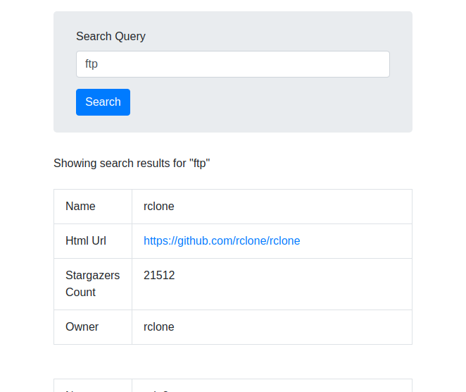
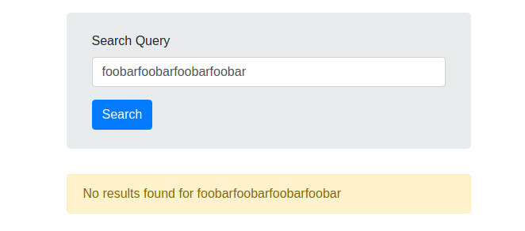
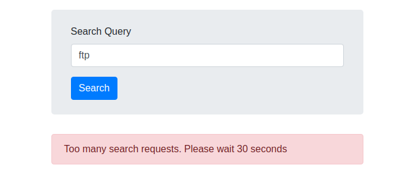
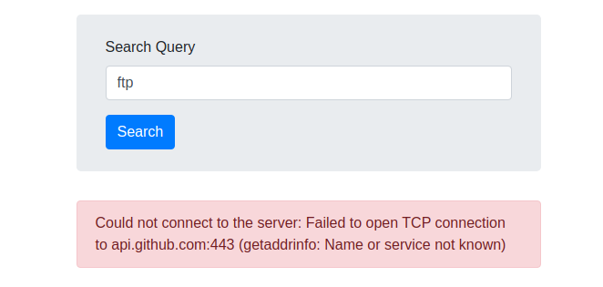

# How to run project with Docker

## Start
```
docker-compose up
```

Open http://localhost:3333 in browser


## Testing
```
docker-compose run --rm web rspec
```

## Linting
```
docker-compose run --rm web rubocop
```

# How to run the application without Docker
Install RVM (https://rvm.io/)
```
rvm install ruby-2.7.1
bundle install
rails server
```

# What was done
* Exception handling and error messages
* Unit tests
* Functional tests

# What was not done (didn't have enough time)
* REST API and React SPA
* i18n
* Writing errors into log file
* Github API credentials
* Showing seconds until rate limit reset
* Moving settings into `.env` file

# Notes
Usually I use `simple_form` (instead of writing wrong html for forms) and `webpack` (to install bootstrap). In this project I don't use them for simplicity.

# Screenshots

<hr />

<hr />

<hr />

